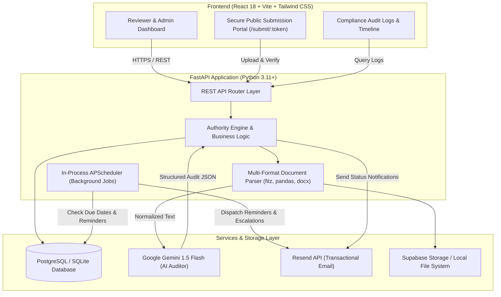
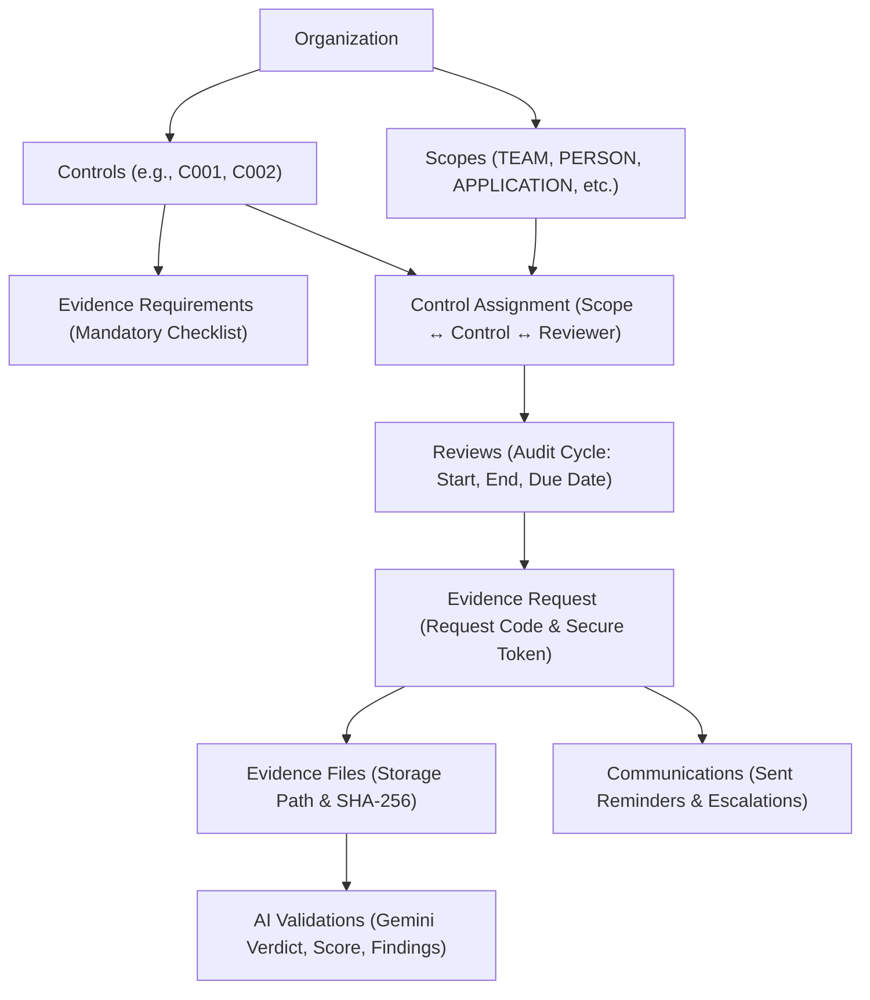
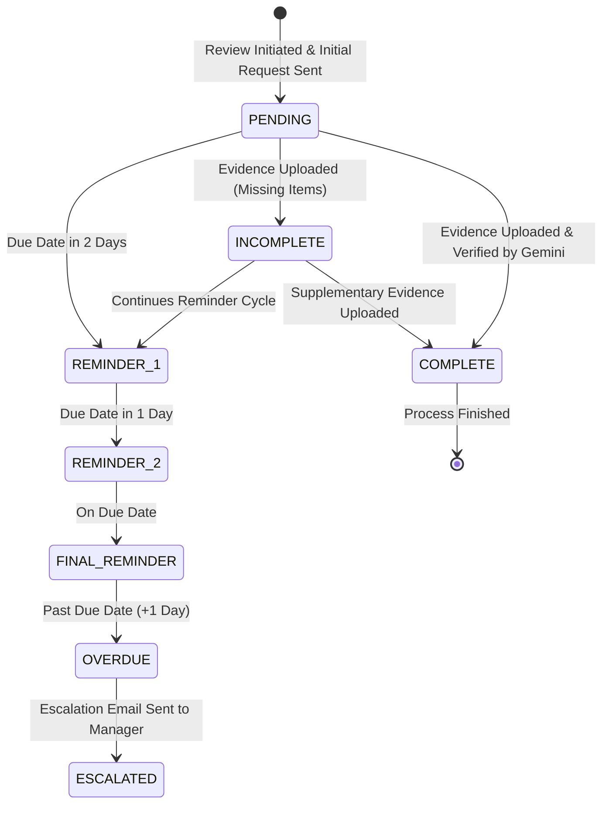

# 🛡️ LOD2 Evidence Bot
### Autonomous Control Testing & AI-Powered Evidence Collection Platform

[](https://fastapi.tiangolo.com)
[](https://react.dev)
[](https://vitejs.dev)
[](https://tailwindcss.com)
[](https://aistudio.google.com)
[](https://www.postgresql.org)
[](LICENSE)

---

## 📖 Table of Contents
1. [Project Overview](#-project-overview)
2. [The Problem & The Solution](#-the-problem--the-solution)
3. [Key Capabilities & Features](#-key-capabilities--features)
4. [System Architecture](#-system-architecture)
5. [Core Business Entities](#-core-business-entities)
6. [Multi-Format Document Parsing & AI Verification](#-multi-format-document-parsing--ai-verification)
7. [Automated Reminder & Escalation Engine](#-automated-reminder--escalation-engine)
8. [Project Directory Layout](#-project-directory-layout)
9. [Getting Started (Step-by-Step Setup Guide)](#-getting-started-step-by-step-setup-guide)
    - [Prerequisites](#prerequisites)
    - [Backend Setup (FastAPI)](#1-backend-setup-fastapi)
    - [Frontend Setup (React + Vite)](#2-frontend-setup-react--vite)
10. [Default Demo Credentials & Pre-Seeded Data](#-default-demo-credentials--pre-seeded-data)
11. [Step-by-Step Demonstration Walkthrough](#-step-by-step-demonstration-walkthrough)
12. [Environment Configuration Reference](#-environment-configuration-reference)
13. [API Reference Overview](#-api-reference-overview)
14. [Cloud Deployment Guide (Render, Supabase, Vercel)](#-cloud-deployment-guide)
15. [Automated Testing](#-automated-testing)
16. [Troubleshooting & FAQ](#-troubleshooting--faq)

---

## 💡 Project Overview

**LOD2 Evidence Bot** is an end-to-end enterprise compliance automation system designed for **Second Line of Defense (LOD2)** control testing, internal audit, and regulatory frameworks (e.g., SOC 2, ISO 27001, SOX ITGC).

In corporate risk and compliance, **Second Line of Defense (LOD2)** teams oversee whether operational teams are adhering to mandated security controls—such as quarterly user access reviews, change management sign-offs, and privilege audits. 

Traditionally, this process requires human auditors to manually send hundreds of reminder emails, collect disparate attachments, inspect spreadsheets page-by-page, track overdue items on sticky notes or Excel, and maintain messy audit trails.

**LOD2 Evidence Bot replaces this manual overhead with an autonomous agentic pipeline**:
- **Automates Evidence Requests**: Initiates recurring review cycles and issues unique, token-secured submission links to business owners.
- **Frictionless Submission**: Control owners don't need complicated logins; they upload documents through a dedicated portal link sent to their email.
- **Multi-Format Ingestion**: Extracts structured text and tabular data from **PDF, Excel (XLSX/XLS), Word (DOCX), and CSV**.
- **Gemini 1.5 Semantic AI Auditing**: Inspects the document content against specific, granular compliance criteria and provides confidence scores, factual audit findings, and missing checklists.
- **Autonomous In-Process Scheduling**: Evaluates deadlines and issues staged reminders (T-2 days, T-1 day, Due date) and management escalations idempotently—without needing heavy message brokers like Redis or Celery.
- **Tamper-Evident Integrity**: Calculates SHA-256 cryptographic hashes for every file and logs every single system action to an immutable audit trail.

---

## 🎯 The Problem & The Solution

| The Traditional Manual Process | The LOD2 Evidence Bot Solution |
| :--- | :--- |
| **Email Overload & Manual Tracking**: Reviewers send one-off emails and track responses in messy spreadsheets. | **Centralized Request Registry**: Automated reviews map controls to scopes with due dates and unique request codes (e.g., `REQ-2026-0001`). |
| **Friction for Business Teams**: Submitters are forced to learn heavy, complex GRC software just to upload a file. | **1-Click Secure Public Portal**: Recipients get a dedicated link (`/submit/:token`) to drag-and-drop their evidence in seconds. |
| **Subjective & Slow Review**: Reviewers take days or weeks reading through documents to check if mandatory approvals are present. | **Instant Gemini AI Verification**: In seconds, Gemini 1.5 evaluates the evidence, extracts dates and sign-offs, and returns an audit verdict (`COMPLETE` vs `INCOMPLETE`). |
| **Human Chase Fatigue**: Auditors forget to send timely reminders or escalate delinquent submissions. | **Autonomous APScheduler Engine**: Built-in background scheduler executes daily reminder workflows and escalates overdue items automatically. |
| **Audit Defense Headaches**: Regulators ask "Who approved what, when?" resulting in days of digging through email archives. | **Immutable Audit Trail & Timeline**: Visual communication timeline and SHA-256 file hashes establish an ironclad chain of custody. |

---

## ⭐ Key Capabilities & Features

- 📑 **Reusable Control Catalog**: Define reusable compliance controls with mandatory/optional evidence requirements (e.g., `C001 - Periodic User Access Review` requiring Access Report, Reviewer Confirmation, Management Approval, and Exception Report).
- 🎯 **Dynamic Organizational Scoping**: Assign controls to different target scopes: `PERSON`, `TEAM`, `DEPARTMENT`, `APPLICATION`, or `SYSTEM_OWNER`, each with its own owner email and escalation contact.
- 🔗 **Tokenized Public Submission Portal**: Submitters access a lightweight, secure upload interface without requiring full user accounts.
- 📄 **Deep Multi-Format Document Parsing**: Page-by-page text layout extraction for PDFs, workbook/sheet extraction for Excel, tabular/paragraph parsing for DOCX, and normalized CSV parsing.
- 🤖 **Structured AI Audit Assessment**: Powered by Google Gemini 1.5 Flash using structured JSON responses with temperature `0.1` for maximum audit repeatability and zero hallucination.
- ⏱️ **Lightweight In-Process Background Scheduler**: Uses `APScheduler` directly within FastAPI—no Redis, RabbitMQ, or Celery required. Runs locally or in a single container with zero extra infrastructure.
- 🛡️ **Cryptographic Deduplication & Integrity**: Every document receives a SHA-256 checksum upon arrival.
- 📬 **Smart Transactional Email Dispatcher**: Integrated with **Resend** for transactional notifications, with an automatic **console-logging mock fallback** for offline testing.
- 🔌 **Zero-Configuration Offline Mode**: Runs anywhere without external cloud dependencies by falling back to **SQLite**, **local disk storage**, **mock email delivery**, and **deterministic rule-based validation**.

---

## 🏗️ System Architecture

The project is structured as a decoupled full-stack application:



---

## 🏛️ Core Business Entities

The system maintains a relational hierarchy from high-level controls down to individual AI assessments:



1. **Scope**: Represents the audit target (`IT Operations Team`, `Finance Team`, `Payments Application`). Tracks the owner's email and a manager escalation email.
2. **Control**: Reusable compliance requirement (e.g., `C001 Periodic User Access Review`).
3. **Control Evidence Requirement**: The specific checklist items required to satisfy the control.
4. **Control Assignment**: Maps a Control to a Scope and assigns a compliance Reviewer.
5. **Review**: A specific audit time window (e.g., Q3 2026: July 1 to Sept 30).
6. **Evidence Request**: The active collection task (`REQ-2026-0001`) with a unique cryptographic `secure_token`.
7. **Evidence**: Binary file uploaded by the submitter, persisted with a SHA-256 checksum.
8. **AI Validation**: Structured audit assessment generated by Gemini.
9. **Communication**: Idempotent audit record of all emails dispatched for this request.

---

## 🔬 Multi-Format Document Parsing & AI Verification

When an evidence document is submitted:

```
Evidence File (.pdf, .xlsx, .docx, .csv)
       │
       ├── 1. Binary validation & Size check (Max 25 MB)
       ├── 2. Cryptographic Checksum generation (SHA-256)
       ├── 3. Persistence (Supabase Storage bucket OR ./storage_uploads)
       │
       ▼
Document Extraction Pipeline:
       ├── PyMuPDF (fitz)   ──► Layout-aware text extraction per page
       ├── pandas/openpyxl  ──► Sheet enumeration, headers & normalized data rows
       ├── python-docx      ──► Heading, paragraph & embedded table extraction
       └── pandas (CSV)     ──► Formatted tabular serialization
       │
       ▼
Normalized Text Buffer (Extracted context up to 35,000 characters)
       │
       ▼
Google Gemini 1.5 Flash (System prompt enforcing strict LOD2 auditing criteria)
       │
       ▼
Deterministic JSON Verdict:
{
  "status": "COMPLETE" | "INCOMPLETE" | "IRRELEVANT",
  "relevance": "HIGH" | "MEDIUM" | "LOW",
  "confidence": 0.94,
  "missingInformation": ["Exception Report", "Approval Evidence"],
  "findings": ["Active Directory roster present with 42 user accounts"],
  "reason": "The evidence demonstrates active user accounts but lacks required manager approval signoff."
}
       │
       ▼
FastAPI Authority Engine:
  ├── If COMPLETE   ──► Request marked COMPLETE; Completion email dispatched
  └── If INCOMPLETE ──► Request marked INCOMPLETE; Missing items email dispatched
```

> [!NOTE]
> **Strict Architectural Principle: AI Interprets; Backend Decides**
> The AI never sends emails directly, alters system permissions, or modifies user accounts. It functions strictly as an objective document evaluator. The FastAPI backend validates the structured AI response and executes the workflow deterministically.

---

## ⏰ Automated Reminder & Escalation Engine

The system features an autonomous background state machine run by **APScheduler**:



### Idempotency Guarantee
The engine checks existing records in the `communications` database table before dispatching any email. If `REMINDER_1` was already sent for `REQ-2026-0001`, it will **never** be sent again, preventing spam and ensuring repeatable audit performance across application restarts.

---

## 📂 Project Directory Layout

```
YG-Hackathon/
├── README.md                           # Comprehensive documentation (this file)
├── seed.py                             # Root convenience database seeding script
├── create_samples.py                   # Generates sample evidence files (.pdf, .xlsx, .docx, .csv)
├── render.yaml                         # Render Blueprint specification for 1-click cloud deployment
├── sample_evidence/                    # Realistic test evidence files
│   ├── Complete_Access_Review_Q3_2026.pdf
│   ├── Incomplete_User_Roster.xlsx
│   ├── Production_Release_CAB_Signoff.docx
│   └── System_Accounts_Export.csv
├── docs/                               # Additional architectural guides
│   ├── ARCHITECTURE.md                 # Detailed architecture design specifications
│   ├── DEMO_FLOW.md                    # 5-10 minute live presentation script
│   └── PRE_RUN_CHECKLIST.md            # Operator checklist & troubleshooting
│
├── backend/                            # FastAPI Python Backend
│   ├── Dockerfile                      # Production container image definition
│   ├── requirements.txt                # Python dependencies
│   ├── alembic.ini                     # Database migration configuration
│   ├── .env.example                    # Backend environment variables template
│   ├── evidence_bot.db                 # Local SQLite database (auto-generated)
│   ├── storage_uploads/                # Local file storage fallback folder
│   ├── app/
│   │   ├── main.py                     # FastAPI application entrypoint & lifespan
│   │   ├── config.py                   # Pydantic Settings configuration
│   │   ├── api/                        # API route controllers
│   │   │   ├── auth.py                 # JWT login, registration, and user profiles
│   │   │   ├── controls.py             # Reusable controls & evidence requirements
│   │   │   ├── scopes.py               # Organizational scopes & owners
│   │   │   ├── assignments.py          # Control-to-scope reviewer assignments
│   │   │   ├── reviews.py              # Review audit cycles & date windows
│   │   │   ├── requests.py             # Evidence request lifecycle & token endpoints
│   │   │   ├── evidence.py             # File upload, parsing & AI validation trigger
│   │   │   ├── dashboard.py            # LOD2 metrics & manual scheduler trigger
│   │   │   ├── audit.py                # System-wide compliance audit log viewer
│   │   │   └── deps.py                 # Dependency injection (DB session, Auth)
│   │   ├── db/
│   │   │   ├── session.py              # SQLAlchemy engine & session factory
│   │   │   ├── base.py                 # Declarative Base
│   │   │   └── seed.py                 # Seed script with realistic LOD2 demo data
│   │   ├── models/
│   │   │   └── __init__.py             # SQLAlchemy ORM models & Enums
│   │   ├── schemas/
│   │   │   └── __init__.py             # Pydantic request & response schemas
│   │   ├── services/
│   │   │   ├── ai/gemini.py            # Gemini 1.5 Flash client & prompt pipeline
│   │   │   ├── documents/extractor.py  # Multi-format document parsing engine
│   │   │   ├── email/resend_service.py # Resend email client & mock logger
│   │   │   ├── reminders/reminder_engine.py # Evaluation & reminder state machine
│   │   │   └── storage/storage_service.py   # Supabase Storage & local disk handler
│   │   ├── jobs/
│   │   │   └── scheduler.py            # APScheduler background runner
│   │   └── utils/
│   │       ├── security.py             # Bcrypt password hashing & JWT tokens
│   │       └── audit.py                # Immutable audit log recorder
│   └── tests/                          # Automated backend test suite (pytest)
│       ├── conftest.py
│       ├── test_auth.py
│       ├── test_controls_and_scopes.py
│       ├── test_document_extraction.py
│       ├── test_ai_validation.py
│       └── test_reminder_engine.py
│
└── frontend/                           # React 18 + Vite + Tailwind CSS Frontend
    ├── package.json                    # Frontend dependencies & scripts
    ├── vite.config.js                  # Vite configuration
    ├── tailwind.config.js              # Tailwind styling setup
    ├── .env.example                    # Frontend environment variables template
    ├── public/
    │   └── _redirects                  # SPA client-side routing redirect rules
    └── src/
        ├── App.jsx                     # Route definitions & ProtectedRoute wrappers
        ├── main.jsx                    # React entrypoint
        ├── index.css                   # Global Tailwind stylesheets
        ├── context/
        │   └── AuthContext.jsx         # User session, JWT storage & auth state
        ├── layouts/
        │   └── AppLayout.jsx           # App layout with Sidebar and Top Navbar
        ├── components/
        │   ├── Navbar.jsx              # Navigation header with user badge & logout
        │   ├── Sidebar.jsx             # Collapsible application navigation
        │   ├── StatCard.jsx            # Metric summary cards
        │   ├── StatusBadge.jsx         # Color-coded compliance status badges
        │   ├── AIValidationCard.jsx    # Visual Gemini AI score, findings & checklist
        │   └── Timeline.jsx            # Chronological communication & upload feed
        ├── pages/
        │   ├── LoginPage.jsx           # Auth page with 1-Click Demo Login buttons
        │   ├── DashboardPage.jsx       # Executive metrics, overdue alerts & controls
        │   ├── ControlsPage.jsx        # Control catalog & requirements manager
        │   ├── ControlDetailPage.jsx   # Specific control view & requirement edit
        │   ├── ScopesPage.jsx          # Target scopes & owners
        │   ├── AssignmentsPage.jsx     # Active control assignments
        │   ├── ReviewsPage.jsx         # Review cycles list & creation modal
        │   ├── ReviewDetailPage.jsx    # Review status & generated requests
        │   ├── EvidenceRequestsPage.jsx# Evidence requests table & status filters
        │   ├── EvidenceRequestDetailPage.jsx # Full request inspector & review actions
        │   ├── PublicSubmissionPage.jsx# Frictionless upload page for business submitters
        │   └── AuditLogsPage.jsx       # Filterable system audit logs
        └── services/
            └── api.js                  # Axios client with JWT interceptor & API endpoints
```

---

## 🚀 Getting Started (Step-by-Step Setup Guide)

Follow these instructions to run the entire application locally on your machine.

### Prerequisites

Ensure you have the following installed:
- **Python**: Version `3.10`, `3.11`, `3.12`, or `3.13` (`python --version`)
- **Node.js**: Version `18.0+` or `20.x LTS` (`node --version`)
- **npm**: Version `9.0+` (`npm --version`)
- **Git**: Installed and configured (`git --version`)

---

### 1. Backend Setup (FastAPI)

#### A. Create and Activate a Virtual Environment

Open a terminal in the root directory `YG-Hackathon`:

**On Windows (PowerShell):**
```powershell
python -m venv venv
.\venv\Scripts\Activate.ps1
```

**On macOS / Linux:**
```bash
python3 -m venv venv
source venv/bin/activate
```

#### B. Install Python Dependencies

```bash
pip install -r backend/requirements.txt
```

#### C. Configure Backend Environment Variables

Create a `.env` file in the `backend/` folder. You can copy the provided example:

**On Windows (PowerShell):**
```powershell
Copy-Item backend\.env.example backend\.env
```

**On macOS / Linux:**
```bash
cp backend/.env.example backend/.env
```

> **Default Zero-Config Mode:**
> By default, `backend/.env` uses SQLite (`DATABASE_URL=sqlite:///./evidence_bot.db`) and local file storage. You **do not need** to install PostgreSQL or setup Supabase to test locally!
> 
> *To enable Google Gemini AI*: Obtain a free key from [Google AI Studio](https://aistudio.google.com) and add it to `GEMINI_API_KEY=your-key` in `backend/.env`. (If omitted, a built-in deterministic auditor evaluates files offline).
> 
> *To enable Resend Emails*: Obtain a free key from [Resend](https://resend.com) and add it to `RESEND_API_KEY=re_your_key` in `backend/.env`. (If omitted, emails are printed directly to the terminal console).

#### D. Seed the Database with Realistic Demo Data

Run the database seed script to populate demo controls, scopes, users, historical reviews, and requests:

```bash
python seed.py
```

*Output should conclude with:*
```
[Seed] Successfully seeded demo users, controls, scopes, assignments, reviews, requests, and validations!
```

#### E. Start the FastAPI Server

Launch the backend API server using Uvicorn:

```bash
uvicorn app.main:app --reload --app-dir backend --port 8000
```

- API Base URL: **`http://localhost:8000`**
- Interactive Swagger Documentation: **`http://localhost:8000/docs`**
- Health Check: **`http://localhost:8000/health`**

---

### 2. Frontend Setup (React + Vite)

Open a **separate terminal window** in the root directory `YG-Hackathon`.

#### A. Navigate to Frontend & Install Dependencies

```bash
cd frontend
npm install
```

#### B. Configure Frontend Environment Variables

Create a `.env` file inside the `frontend/` folder:

**On Windows (PowerShell):**
```powershell
Copy-Item .env.example .env
```

**On macOS / Linux:**
```bash
cp .env.example .env
```

Ensure `frontend/.env` contains:
```env
VITE_API_BASE_URL=http://localhost:8000
```

#### C. Start the Vite Development Server

```bash
npm run dev
```

- The React application will be live at: **`http://localhost:5173`**

---

## 👥 Default Demo Credentials & Pre-Seeded Data

The seed script creates four default user accounts with pre-configured roles:

| Role | Email | Password | Access & Capabilities |
| :--- | :--- | :--- | :--- |
| **Reviewer** | `Abhishek@gmail.com` *(or `reviewer@example.com`)* | `Password123!` | Executive dashboard, review initiation, manual reminders, evidence inspection |
| **Admin** | `admin@example.com` | `Password123!` | System configuration, controls, scopes, assignments, audit logs |
| **Business User** | `business@example.com` | `Password123!` | Evidence submission interface |
| **Escalation Contact** | `escalation@example.com` | `Password123!` | Manager escalation recipient for delinquent requests |

> [!TIP]
> The login screen at `http://localhost:5173/login` includes **1-Click Demo Login buttons** to quickly fill in credentials with one click.

### Pre-Seeded Evidence Requests & Direct Links

The database includes four pre-seeded evidence requests demonstrating every state of the lifecycle:

| Request Code | Target Scope | Control | Due Date Status | Secure Public Link |
| :--- | :--- | :--- | :--- | :--- |
| **`REQ-2026-0001`** | `IT Operations Team` | `C001 Periodic User Access Review` | **Pending** (Due in 5 days) | [Submit REQ-2026-0001](http://localhost:5173/submit/demo-token-itops-2026-0001) |
| **`REQ-2026-0002`** | `Finance Team` | `C001 Periodic User Access Review` | **Overdue** (3 days late) | [Submit REQ-2026-0002](http://localhost:5173/submit/demo-token-finance-2026-0002) |
| **`REQ-2026-0003`** | `Payments Application` | `C002 Production Change Management` | **Complete** (Verified) | [Submit REQ-2026-0003](http://localhost:5173/submit/demo-token-payments-2026-0003) |
| **`REQ-2026-0004`** | `Jai Ram (DBA)` | `C001 Periodic User Access Review` | **Incomplete** (Missing Items) | [Submit REQ-2026-0004](http://localhost:5173/submit/demo-token-john-2026-0004) |

---

## 🎬 Step-by-Step Demonstration Walkthrough

You can follow this 5-minute walkthrough to test every feature of the bot using the files in `sample_evidence/`:

### Step 1: Sign in as Reviewer
1. Go to `http://localhost:5173/login`.
2. Click the **Reviewer** demo button (or enter `Abhishek@gmail.com` / `Password123!`).
3. Click **Sign In**.
4. You are greeted by the **Executive Dashboard**, showing LOD2 metrics: Total Controls, Active Assignments, Complete, Incomplete, and Overdue requests.

### Step 2: Recipient Uploads Incomplete Evidence
1. Navigate directly to the public submission portal for IT Operations:
   `http://localhost:5173/submit/demo-token-itops-2026-0001`
   *(Notice that no login is required—this simulates the link sent in the email).*
2. Select the file: `sample_evidence/Incomplete_User_Roster.xlsx`.
3. Click **Upload & Verify**.
4. The backend extracts the Excel columns and feeds them to Gemini:
   - Status changes to **`INCOMPLETE`**.
   - Gemini flags that the user roster was provided, but mandatory **`Approval Evidence`** and **`Exception Report`** are missing.
   - The backend records a `MISSING_EVIDENCE` communication in the timeline.

### Step 3: Recipient Uploads Complete Evidence
1. On the same submission page, choose the comprehensive file:
   `sample_evidence/Complete_Access_Review_Q3_2026.pdf`.
2. Click **Upload & Verify**.
3. Watch the Gemini AI verification card update in real-time:
   - Status transitions to **`COMPLETE`**.
   - Model confidence displays at **`94%+`**.
   - Green checklist confirms all 4 requirements (*Access Review Report*, *Reviewer Confirmation*, *Approval Evidence*, and *Exception Report*) were identified.
   - The backend marks the request as `COMPLETE` and triggers a completion notice.

### Step 4: Inspect Central Dashboard & Audit Timeline
1. Return to the Reviewer interface at `http://localhost:5173/dashboard`.
2. The request is now counted under **Complete**.
3. Open `http://localhost:5173/evidence-requests/1` to view the **Communication & Verification Timeline**:
   - Initial Request ➔ Incomplete Notice ➔ Upload ➔ Supplementary Upload ➔ Acceptance.
4. Click **Audit Logs** in the sidebar: Observe the immutable audit log recording the actor, action, SHA-256 hash, and timestamp.

### Step 5: Test the Autonomous Reminder Engine
1. On the Dashboard, locate the red **Overdue Alert Banner** highlighting delinquent submissions from the Finance Team.
2. Click the **Trigger Reminders & Escalations** button.
3. The in-process scheduler evaluates all open requests:
   - Sends an escalation email to the manager for `REQ-2026-0002`.
   - Records the event in the audit trail.
   - Updates the reminder count idempotently without duplicate notifications.

---

## ⚙️ Environment Configuration Reference

### Backend (`backend/.env`)

| Variable | Default Value | Description |
| :--- | :--- | :--- |
| `DATABASE_URL` | `sqlite:///./evidence_bot.db` | PostgreSQL connection string or local SQLite URI |
| `JWT_SECRET` | *(Required in prod)* | 32+ character secret key for signing HS256 tokens |
| `JWT_ALGORITHM` | `HS256` | JWT signature algorithm |
| `ACCESS_TOKEN_EXPIRE_MINUTES` | `1440` (24 hours) | Token lifespan before expiration |
| `GEMINI_API_KEY` | `""` | Google AI Studio API key (fallback enabled if blank) |
| `GEMINI_MODEL` | `gemini-1.5-flash` | Gemini model name |
| `RESEND_API_KEY` | `""` | Resend API key (terminal console fallback if blank) |
| `EMAIL_FROM` | `onboarding@resend.dev` | Sender address for transactional emails |
| `SUPABASE_URL` | `""` | Supabase project URL (local filesystem fallback if blank) |
| `SUPABASE_SERVICE_ROLE_KEY` | `""` | Supabase secret key for storage uploads |
| `SUPABASE_STORAGE_BUCKET` | `evidence-files` | Name of storage bucket for evidence files |
| `LOCAL_STORAGE_DIR` | `./storage_uploads` | Directory for local file persistence |
| `FRONTEND_URL` | `http://localhost:5173` | Frontend URL for generating submission links |
| `CORS_ORIGINS` | `http://localhost:5173,http://localhost:3000` | Allowed origins for browser CORS |
| `REMINDER_INTERVAL_MINUTES` | `60` | Background scheduler check frequency |
| `REMINDER_1_DAYS_BEFORE` | `2` | Days before due date to issue Reminder #1 |
| `REMINDER_2_DAYS_BEFORE` | `1` | Days before due date to issue Reminder #2 |
| `ESCALATION_DAYS_AFTER` | `1` | Days overdue before escalating to manager |

### Frontend (`frontend/.env`)

| Variable | Default Value | Description |
| :--- | :--- | :--- |
| `VITE_API_BASE_URL` | `http://localhost:8000` | Target FastAPI backend URL |

---

## 📡 API Reference Overview

The FastAPI backend exposes RESTful endpoints grouped by domain:

### Authentication (`/api/auth`)
- `POST /api/auth/register` - Create a new user account
- `POST /api/auth/login` - Authenticate with email/password and receive a JWT
- `GET /api/auth/me` - Retrieve authenticated user profile

### Controls & Scopes (`/api/controls`, `/api/scopes`)
- `GET /api/controls` - List all compliance controls
- `POST /api/controls` - Create a control with evidence requirements
- `GET /api/controls/{id}` - Retrieve control details and checklist items
- `GET /api/scopes` - List organizational scopes (Teams, Applications, Persons)
- `POST /api/scopes` - Register a new scope with owner and escalation email

### Reviews & Requests (`/api/reviews`, `/api/evidence-requests`)
- `GET /api/reviews` - List audit cycles
- `POST /api/reviews` - Initiate a review cycle and generate evidence requests
- `GET /api/evidence-requests` - List all requests with status filters
- `GET /api/evidence-requests/{id}` - Inspect request, uploaded files, and validations
- `GET /api/evidence-requests/token/{token}` - Public portal data lookup for submission token
- `POST /api/evidence-requests/{id}/remind` - Manually trigger a reminder email
- `POST /api/evidence-requests/{id}/escalate` - Manually trigger an escalation email
- `POST /api/evidence-requests/{id}/mark-complete` - Reviewer manual override to accept request

### Evidence Upload & AI (`/api/evidence`)
- `POST /api/evidence/upload` - Multipart file upload (`.pdf`, `.xlsx`, `.docx`, `.csv`); triggers parsing and Gemini AI validation
- `GET /api/evidence/{id}` - Retrieve file metadata and extracted text
- `POST /api/evidence/{id}/revalidate` - Re-run AI validation on an existing file

### Executive Dashboard & Audits (`/api/dashboard`, `/api/audit-logs`)
- `GET /api/dashboard/summary` - Aggregate metrics (total, complete, incomplete, overdue)
- `GET /api/dashboard/overdue` - List delinquent requests
- `POST /api/dashboard/trigger-reminders` - Manually trigger the APScheduler evaluation engine
- `GET /api/audit-logs` - Query filterable system audit events

---

## ☁️ Cloud Deployment Guide

### Deploying the Backend to Render (1-Click Blueprint)

The repository includes a `render.yaml` specification for zero-hassle Docker deployment on **Render**:

1. Fork or push this repository to GitHub.
2. Sign in to [Render](https://render.com) and click **New +** ➔ **Blueprint**.
3. Connect your repository. Render will automatically parse `render.yaml`.
4. Fill in your environment variables:
   - `GEMINI_API_KEY`: Your key from Google AI Studio
   - `RESEND_API_KEY`: Your key from Resend (optional)
   - `CORS_ORIGINS`: Your production frontend URL (e.g. `https://your-app.vercel.app`)
   - `FRONTEND_URL`: Your production frontend URL
5. Click **Apply**. Render will build the Docker container and start the service with a persistent health check at `/health`.

### Deploying the Frontend to Vercel or Netlify

1. Sign in to [Vercel](https://vercel.com) or [Netlify](https://netlify.com).
2. Import your GitHub repository.
3. Configure the build settings:
   - **Root Directory**: `frontend`
   - **Build Command**: `npm run build`
   - **Output Directory**: `dist`
4. Set the environment variable:
   - `VITE_API_BASE_URL`: The URL of your deployed Render backend (e.g. `https://evidence-bot-api.onrender.com`)
5. Click **Deploy**.

*(Note: `frontend/public/_redirects` is already included to ensure client-side React routing works seamlessly on Netlify/Vercel).*

---

## 🧪 Automated Testing

The backend includes a comprehensive automated test suite in `backend/tests/` covering:
- User registration, password verification, and JWT authentication
- Control creation, scope assignment, and review generation
- Multi-format document text extraction (PDF, Excel, DOCX, CSV)
- Structured AI validation response parsing and fallbacks
- APScheduler reminder evaluation and escalation idempotency

To run the test suite:

```bash
# Ensure your virtual environment is active
pytest backend/tests/ -v
```

---

## ❓ Troubleshooting & FAQ

### 1. Browser shows "CORS Error" or network request fails
- Ensure the backend server is running on `http://localhost:8000`.
- Verify `backend/.env` contains `CORS_ORIGINS=http://localhost:5173`.
- Verify `frontend/.env` contains `VITE_API_BASE_URL=http://localhost:8000`.

### 2. Can I run the project without a Google Gemini API key?
- **Yes!** The system includes a deterministic rule-based auditor fallback. If `GEMINI_API_KEY` is not provided, the service scans extracted documents against control requirements and returns structured validation results offline.

### 3. Can I run the project without a Resend email key?
- **Yes!** If `RESEND_API_KEY` is blank, emails are not sent over the internet; instead, email subjects, bodies, and recipients are printed directly to the terminal console and recorded in the database `communications` table.

### 4. How do I reset the local database?
- Simply delete `backend/evidence_bot.db` and run `python seed.py` from the root directory.

### 5. `ModuleNotFoundError: No module named 'fitz'`
- PyMuPDF is installed under the package name `pymupdf`. Run `pip install pymupdf` inside your active virtual environment.

---

## 📄 License

This project is licensed under the MIT License — see the [LICENSE](LICENSE) file for details.
