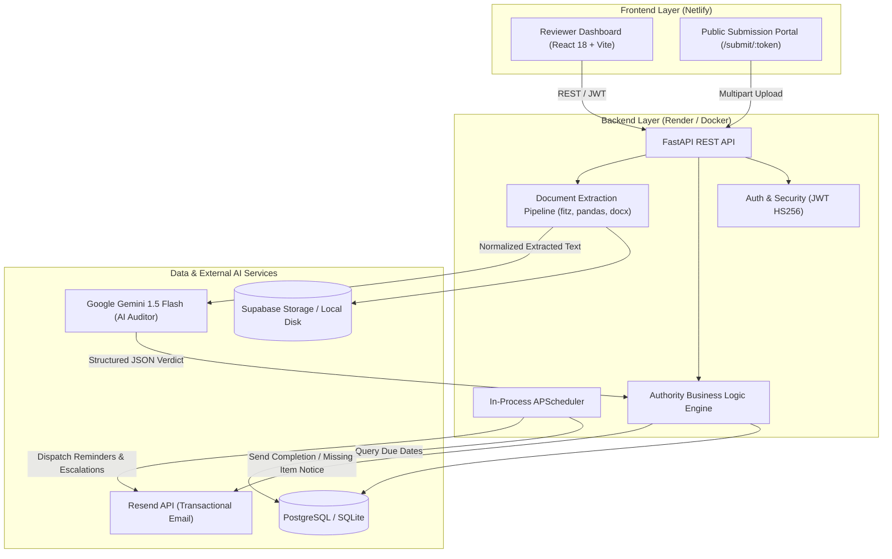
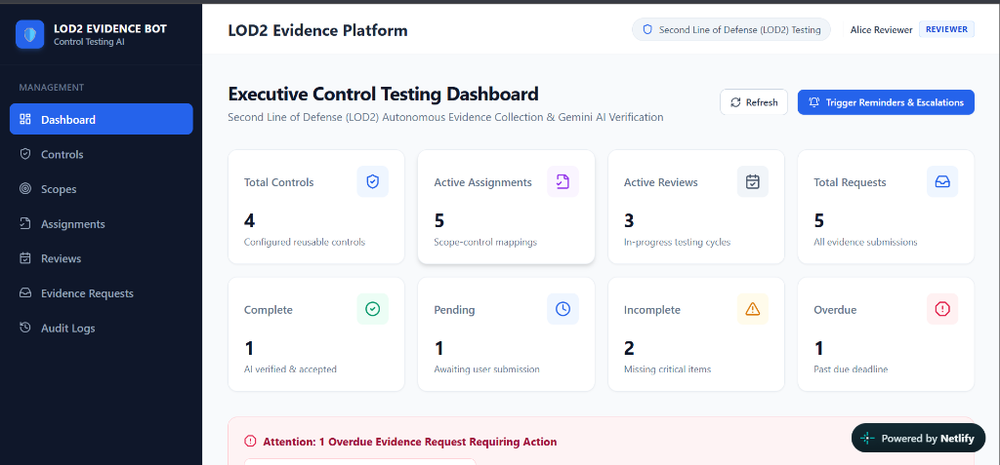
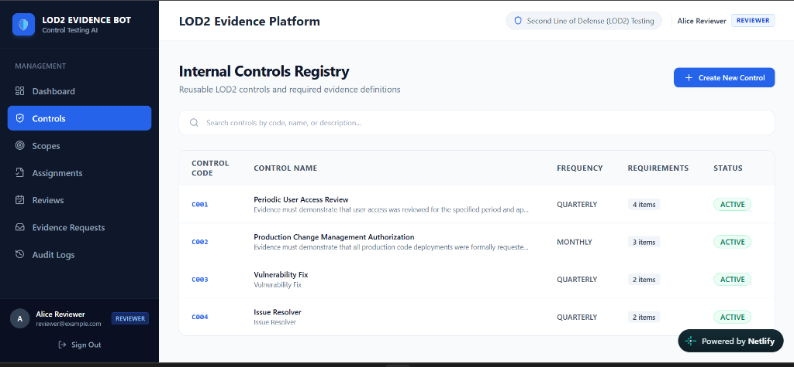
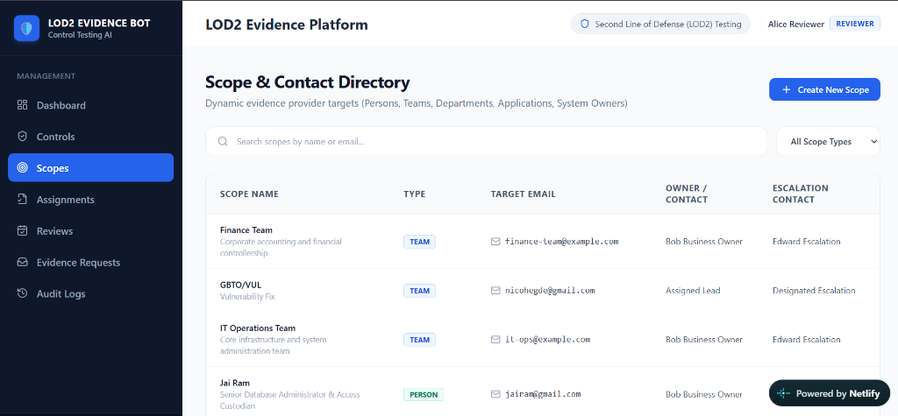
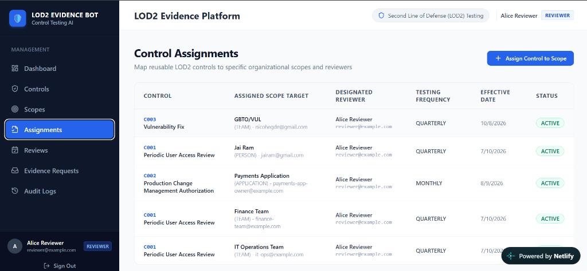
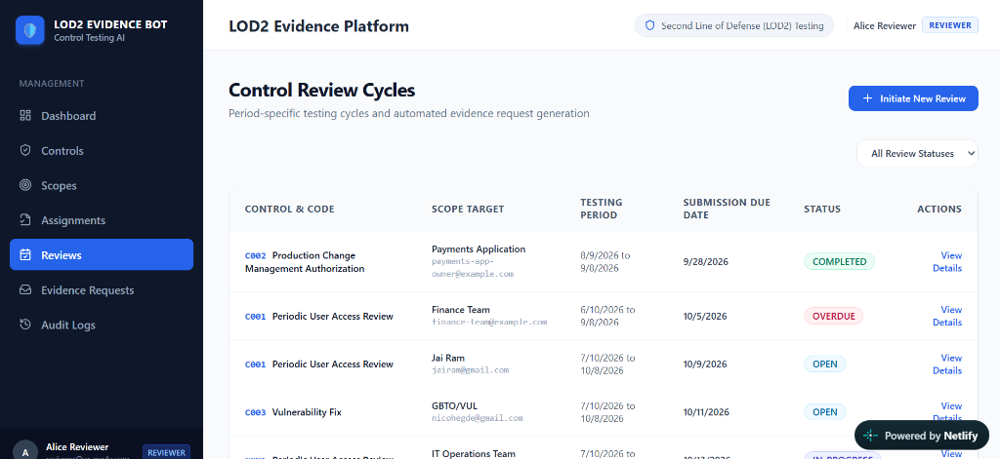

# LEAP Young Innovators Hackathon 2026

Welcome to your team's private workspace for the **LEAP Young Innovators Hackathon 2026**.

Use this repository to collaborate, develop, test, document, and submit your solution. Keep the repository private and follow all applicable organizational security, data-protection, open-source, and technology standards.

---

## Team Information

| Field | Details |
| :--- | :--- |
| **Team Name** | _THE ORCHESTRATORS_ |
| **Stream** | Stream 4 |
| **Department** | GBTO |
| **Problem Statement** | **AI-Powered Evidence Collection** |
| **Team Lead** | _Sahana HJ_ |
| **Team Members** | _Prateek Gajanan Bhandari, Darshan Prashant Hegde, Vivek N, Preethi Kunshetty_ |

---

## Problem Statement: AI-Powered Evidence Collection

### The Challenge: Manual Compliance Testing & The Evidence Collection Bottleneck
In modern enterprise risk management and regulatory compliance (**SOC 2 Type II, ISO 27001, SOX ITGC, and internal risk policies**), organizations maintain a **Second Line of Defense (LOD2)**. LOD2 compliance officers and internal auditors are responsible for independently verifying that operational teams (**LOD1**) adhere to mandatory controls—such as quarterly privileged user access reviews, change management sign-offs, vulnerability remediation, and database access logs.

Today, this process is plagued by massive manual friction:
1. **Endless Email Chasing**: Reviewers spend up to 70% of their audit cycle manually drafting follow-ups, chasing control owners across teams, and tracking deadlines on fragmented spreadsheets.
2. **Submitter Friction & Delays**: Business users and engineers are forced to navigate complex enterprise GRC tools just to upload a file, causing procrastination and missed audit deadlines.
3. **Slow, Subjective Reviews**: Reviewers must manually read 50+ page PDF exports, multi-tab Excel workbooks, and Jira screenshots to verify whether mandatory approvals and dates align with the audit period.
4. **Late Discovery of Deficiencies**: Incomplete or incorrect submissions are often discovered weeks after submission, creating last-minute compliance panics.
5. **Audit Defense Vulnerabilities**: Disjointed file storage (inbox attachments, shared folders, chat exports) makes proving an immutable chain of custody to external regulators slow and error-prone.

---

## Proposed Solution

### The Proposed Solution: LOD2 Evidence Bot
**LOD2 Evidence Bot** is an autonomous, agentic compliance automation platform designed to turn manual control testing into a frictionless, self-governing workflow:
- **1-Click Tokenized Public Portal**: Control owners receive an email notification containing a secure, personalized submission link (`/submit/:token`). They drag-and-drop evidence files in seconds without needing a system login.
- **Deep Multi-Format Document Parsing**: Automatically ingests and serializes layout-aware content from **PDF, Excel (XLSX/XLS), Word (DOCX), and CSV** up to 35,000 characters.
- **Google Gemini 1.5 Flash Semantic Auditing**: Employs an expert LOD2 auditor prompt with temperature `0.1` to evaluate documents against strict control requirements, returning structured JSON verdicts (`COMPLETE`, `INCOMPLETE`, or `IRRELEVANT`), confidence scores, factual findings, and missing checklists.
- **In-Process Autonomous Reminder & Escalation State Machine**: A lightweight **APScheduler** background runner continuously monitors due dates and sends staged reminders (T-2 days, T-1 day, Due date) and management escalations idempotently—without requiring external brokers like Redis or Celery.
- **Cryptographic Chain of Custody**: Calculates SHA-256 hashes for all uploaded assets and records all lifecycle events in an immutable compliance audit trail.

### Target Users
- **LOD2 Compliance Reviewers & Risk Officers**: Monitor organization-wide control health, trigger reviews, and inspect audit findings.
- **First Line Control Owners (LOD1)**: Team leads, system admins, and engineering managers who submit evidence via frictionless token links.
- **Management & Escalation Contacts**: Department heads who receive automated escalation alerts for overdue compliance obligations.
- **External & Internal Auditors (LOD3)**: Inspect tamper-evident audit logs and SHA-256 evidence integrity.

### Expected Business Value
- **80% Reduction in Reviewer Overhead**: Automates routine reminder emails, follow-ups, and preliminary document scanning.
- **Zero Onboarding Friction**: Submissions take less than 60 seconds for business users via token links.
- **Instant Defect Feedback**: Submitters receive immediate AI feedback on missing approvals before deadlines pass.
- **Cost Efficiency**: Runs in-process with SQLite/PostgreSQL and APScheduler with zero message broker infrastructure costs.

### Key Differentiators
- **Strict Boundary Principle (AI Interprets; Backend Decides)**: The AI never modifies permissions or directly sends emails. It outputs structured JSON; the deterministic FastAPI backend validates the findings and drives workflows.
- **Broker-Free Background Scheduling**: Runs directly inside FastAPI lifespan, eliminating Redis, RabbitMQ, and Celery overhead.
- **Zero-Config Offline Mode**: Seamless local fallback to SQLite, local disk storage, console mock emails, and rule-based validation if cloud keys are absent.

### Expected Impact
Eliminates compliance audit crunches, maintains continuous audit readiness, enforces organizational accountability, and ensures complete transparency across all control testing cycles.

---

## Key Features

1. **Reusable Internal Controls Registry**: Define compliance controls with configurable frequencies (`MONTHLY`, `QUARTERLY`, `ANNUAL`) and granular mandatory/optional requirement checklists.
2. **Dynamic Organizational Scoping**: Target controls at diverse entities (`TEAM`, `PERSON`, `APPLICATION`, `DEPARTMENT`) with independent owner and manager escalation contacts.
3. **Frictionless Tokenized Public Submission Portal**: Dedicated link (`/submit/:token`) allowing submitters to upload evidence without learning complex GRC software.
4. **Deep Multi-Format Document Parsing**: Custom extraction pipeline for PDF layout text (PyMuPDF `fitz`), multi-sheet Excel (pandas/openpyxl), DOCX headings/tables, and CSV files.
5. **Google Gemini 1.5 Flash Semantic AI Auditing**: Deterministic structured JSON evaluation producing confidence scores, verified findings, and missing checklists.
6. **Autonomous Reminder & Escalation State Machine**: Background scheduler dispatches staged reminders (T-2, T-1, Due date) and management escalations idempotently.
7. **Cryptographic Integrity & Immutable Audit Trail**: Generates SHA-256 checksums for all files and records an audit log for every system action.
8. **Executive LOD2 Dashboard & Chronological Timeline**: Real-time metrics overview, overdue alert banners, and chronological visual feeds of all communications and uploads.

---

## Solution Architecture

The architecture diagram and detailed specifications are documented under [docs/architecture/README.md](docs/architecture/README.md) and [docs/ARCHITECTURE.md](docs/ARCHITECTURE.md).



### Architectural Breakdown
- **User Interface**: React 18 SPA built with Vite and Tailwind CSS. Provides executive dashboards, catalog managers, chronological timelines, and a public submission portal.
- **Backend Services**: FastAPI asynchronous REST API running on Python 3.11+. Features a layered architecture: Router Layer, Authority Engine, Document Extraction Service, and in-process `APScheduler`.
- **AI / ML Components**: Google Gemini 1.5 Flash configured with structured JSON schema output, temperature `0.1`, and a fallback deterministic rule-based auditor for offline resilience.
- **Data Sources & Extraction**:
  - PDF: Page-by-page layout extraction via PyMuPDF (`fitz`).
  - Excel: Multi-sheet enumeration and cell normalization via `pandas` and `openpyxl`.
  - Word: Heading, paragraph, and table extraction via `python-docx`.
  - CSV: Tabular row serialization via `pandas`.
- **APIs & Integrations**:
  - Resend API for transactional notification emails (with terminal console mock fallback).
  - Supabase Storage bucket for cloud file persistence (with local directory fallback).
- **Security Controls**:
  - Salted Bcrypt password hashing and JWT (HS256) session tokens.
  - Role-Based Access Control (`ADMIN`, `REVIEWER`, `BUSINESS_USER`).
  - Cryptographically secure public submission tokens.
  - File upload restrictions (maximum 25MB, validated extensions).
  - SHA-256 file hashing for deduplication and non-repudiation.
- **Deployment Model**: Fully Dockerized backend hosted on **Render**; frontend SPA hosted on **Netlify**.

---

## Technology Stack

- **Frontend:** React 18, Vite 5, Tailwind CSS 3.4, React Router v6, Axios, Lucide React
- **Backend:** FastAPI 0.110+, Python 3.11+, SQLAlchemy 2.0, Uvicorn, APScheduler 3.10+
- **Database:** PostgreSQL (Supabase) / SQLite (`sqlite:///./evidence_bot.db` local fallback)
- **AI/ML:** Google Gemini 1.5 Flash (`google-generativeai`), PyMuPDF (`fitz`), openpyxl, python-docx, pandas
- **APIs and integrations:** Resend API (Transactional Email), Supabase Storage (S3-compatible bucket)
- **Deployment:** Netlify (Frontend), Render (Dockerized Backend Web Service)
- **Testing:** Pytest 8.0+, Pytest-asyncio, HTTPX, SQLite in-memory test database

---

## Suggested Repository Structure

```text
YG-Hackathon/
├── .github/                            # CI/CD workflows and repository templates
├── docs/                               # Architecture and supporting documentation
│   ├── ARCHITECTURE.md                 # System architecture specifications
│   ├── DEMO_FLOW.md                    # 5-10 minute live presentation script
│   ├── PRE_RUN_CHECKLIST.md            # Operator setup and run checklist
│   ├── architecture/                   # Architecture diagrams and design files
│   │   └── README.md
│   └── screenshots/                    # Live platform screenshots
│       ├── 01_dashboard.png
│       ├── 02_controls_registry.png
│       ├── 03_scopes_directory.png
│       ├── 04_control_assignments.png
│       └── 05_review_cycles.png
├── backend/                            # Application backend source code
│   ├── Dockerfile                      # Production Docker container definition
│   ├── requirements.txt                # Python backend dependencies
│   ├── alembic.ini                     # Database migration configuration
│   ├── .env.example                    # Safe backend configuration example
│   ├── app/                            # FastAPI application package
│   │   ├── main.py                     # Entrypoint & async lifespan
│   │   ├── config.py                   # Pydantic Settings
│   │   ├── api/                        # REST API routers
│   │   ├── db/                         # Database session, models & seed
│   │   ├── models/                     # SQLAlchemy ORM entity definitions
│   │   ├── schemas/                    # Pydantic request/response schemas
│   │   ├── services/                   # AI, document, email & reminder engines
│   │   └── utils/                      # Security & audit logging utilities
│   └── tests/                          # Automated backend test suite
├── frontend/                           # Application frontend source code
│   ├── package.json                    # Frontend dependencies and scripts
│   ├── vite.config.js                  # Vite configuration
│   ├── tailwind.config.js              # Tailwind styling setup
│   ├── .env.example                    # Safe frontend configuration example
│   ├── public/                         # Static assets and Netlify _redirects
│   └── src/                            # React application source code
├── sample_evidence/                    # Realistic test evidence files (.pdf, .xlsx, etc.)
├── seed.py                             # Root database seed convenience script
├── create_samples.py                   # Test evidence generation script
├── render.yaml                         # Render 1-click cloud deployment blueprint
├── CONTRIBUTING.md                     # Collaboration guidance
├── SECURITY.md                         # Security policies and guidelines
├── SUBMISSION.md                       # Final hackathon submission form
└── README.md                           # Project overview (this file)
```

---

## Setup and Execution

### Prerequisites

| Tool | Minimum Version | Recommended Version | Verification Command |
| :--- | :--- | :--- | :--- |
| **Python** | 3.10+ | 3.11 – 3.13 | `python --version` |
| **Node.js** | 18.0+ | 20.x LTS | `node --version` |
| **npm** | 9.0+ | 10.x | `npm --version` |
| **Docker** | 20.10+ | Latest | `docker --version` |
| **Git** | 2.30+ | Latest | `git --version` |

---

### Installation

#### 1. Clone the repository:
```bash
git clone https://github.com/your-username/YG-Hackathon.git
cd YG-Hackathon
```

#### 2. Backend Installation:
**On Windows (PowerShell):**
```powershell
python -m venv venv
.\venv\Scripts\Activate.ps1
pip install -r backend/requirements.txt
```

**On macOS / Linux:**
```bash
python3 -m venv venv
source venv/bin/activate
pip install -r backend/requirements.txt
```

#### 3. Frontend Installation:
```bash
cd frontend
npm install
cd ..
```

---

### Configuration

1. **Backend Configuration:**
   Copy the example file to `backend/.env`:
   ```bash
   # Windows PowerShell:
   Copy-Item backend/.env.example backend/.env
   # macOS / Linux:
   cp backend/.env.example backend/.env
   ```

   > **Zero-Config Mode**: By default, `backend/.env` uses SQLite (`DATABASE_URL=sqlite:///./evidence_bot.db`), local disk storage, console mock emails, and rule-based validation fallback. **No cloud accounts are required to run locally!**
   > - To enable real Gemini AI audits: Add `GEMINI_API_KEY=your-api-key` (from [Google AI Studio](https://aistudio.google.com)).
   > - To enable real transactional emails: Add `RESEND_API_KEY=your-resend-key` (from [Resend](https://resend.com)).

2. **Frontend Configuration:**
   Copy the example file to `frontend/.env`:
   ```bash
   # Windows PowerShell:
   Copy-Item frontend/.env.example frontend/.env
   # macOS / Linux:
   cp frontend/.env.example frontend/.env
   ```
   Ensure it contains:
   ```env
   VITE_API_BASE_URL=http://localhost:8000
   ```

3. **Never commit populated secret files.** All secrets remain in `.env` (ignored by `.gitignore`).

---

### Run

#### Option A: Running with Docker (Recommended for Containerized Environments)

```bash
# 1. Build backend Docker image
docker build -t evidence-bot-backend ./backend

# 2. Run backend container
docker run -d \
  --name evidence-bot \
  -p 8000:10000 \
  -e PORT=10000 \
  -e DATABASE_URL=sqlite:///./evidence_bot.db \
  -e JWT_SECRET=hackathon-dev-secret-key-32-character-min-key-12345 \
  -e CORS_ORIGINS=http://localhost:5173,https://ygsupa.netlify.app \
  -e FRONTEND_URL=http://localhost:5173 \
  evidence-bot-backend

# 3. Start frontend dev server
cd frontend
npm run dev
```

#### Option B: Running Locally from Source

1. **Seed the database with demo controls and requests:**
   ```bash
   python seed.py
   ```

2. **Start the FastAPI backend:**
   ```bash
   uvicorn app.main:app --reload --app-dir backend --port 8000
   ```
   - API running at: `http://localhost:8000`
   - Interactive Swagger API docs: `http://localhost:8000/docs`

3. **Start the React frontend (in a second terminal):**
   ```bash
   cd frontend
   npm run dev
   ```
   - Frontend web app running at: `http://localhost:5173`

---

## Testing

The backend includes a comprehensive automated test suite covering authentication, control creation, multi-format document extraction, Gemini AI validation responses, and APScheduler deadline evaluations:

```bash
# Ensure your virtual environment is active
pytest backend/tests/ -v
```

### Expected Results
- `test_auth.py`: Verifies user registration, password hashing with bcrypt, JWT token issuing, and `/api/auth/me`.
- `test_controls_and_scopes.py`: Verifies control creation, evidence requirement attachments, and scope assignments.
- `test_document_extraction.py`: Verifies extraction of text from PDF, multi-sheet Excel, DOCX tables, and CSVs.
- `test_ai_validation.py`: Verifies parsing of structured Gemini JSON responses and offline rule-based fallback evaluations.
- `test_reminder_engine.py`: Verifies APScheduler date threshold calculations, overdue tagging, and idempotent reminder dispatching.

---

## Security and Compliance

- **No Secrets in Source**: Passwords, tokens, API keys, and certificates are strictly excluded from source control.
- **No Production / PII Data**: Uses synthetic, randomized demo users and simulated audit evidence.
- **Dependency Integrity**: Dependencies are locked and pinned in `requirements.txt` and `package-lock.json`.
- **Cryptographic Security**: Passwords hashed with salted Bcrypt. Cryptographic tokens (`secure_token`) protect submission URLs. Uploaded files hashed with SHA-256.
- **Strict Architecture Boundary**: AI acts strictly as an objective analyzer; the backend makes all authoritative database and authorization decisions.
- **Read [SECURITY.md](SECURITY.md) before development.**

---

## Business Impact

- **Time Saved**: Reduces manual compliance officer workload by **80%** by eliminating repetitive email follow-ups and manual report reading.
- **Cost Reduction**: Replaces expensive third-party compliance reminder modules with an autonomous in-process engine requiring zero Redis or Celery infrastructure.
- **Risk Reduction**: Drastically reduces audit deficiency risks by catching missing approvals and non-compliant dates in real time before deadlines pass.
- **Better User Experience**: Control owners can submit evidence in under 60 seconds through a dedicated token link without remembering passwords or navigating enterprise GRC software.
- **Process Standardization**: Enforces uniform, objective testing criteria across every department, system, and review cycle.
- **Scalability**: Capable of handling thousands of controls, scopes, and recurring review cycles with minimal compute overhead.

---

## Demo and Presentation

### Live Application Links
- **Application / Hosted URL:** [https://ygsupa.netlify.app/](https://ygsupa.netlify.app/)
- **Demo Recording:** _Update link here_
- **Presentation:** _Update link here_

### Pre-Seeded Demo Credentials

| Role | Email | Password | Access & Capabilities |
| :--- | :--- | :--- | :--- |
| **Reviewer** | `reviewer@example.com` *(or `Abhishek@gmail.com`)* | `Password123!` | Executive dashboard, review initiation, manual reminder triggers |
| **Admin** | `admin@example.com` | `Password123!` | Full control creation, scope registry, system audit logs |
| **Business User** | `business@example.com` | `Password123!` | Evidence submission interface |

> [!TIP]
> Use the **1-Click Demo Login** buttons on the login screen (`/login`) to sign in instantly with one click.

---

### Visual Walkthrough & Platform Screenshots

#### 1. Executive Control Testing Dashboard
High-level LOD2 metrics overview, overdue alert banner, and automated reminder trigger.


#### 2. Internal Controls Registry
Reusable repository of compliance controls with frequency and mandatory requirement checklists.


#### 3. Scope & Contact Directory
Dynamic scoping directory mapping teams, applications, and individuals with escalation contacts.


#### 4. Control Assignments
Mapping reusable controls to organizational targets and designated reviewers.


#### 5. Control Review Cycles
Period-specific testing cycles, submission due dates, and completion statuses.


#### 6. Public Submission Experience & Real-Time Gemini Verification
Test live public submission tokens without login:
- [Submit REQ-2026-0001 (IT Operations Team)](https://ygsupa.netlify.app/submit/demo-token-itops-2026-0001)
  - Test uploading `sample_evidence/Incomplete_User_Roster.xlsx` ➔ Gemini flags missing approval evidence (`INCOMPLETE`).
  - Test uploading `sample_evidence/Complete_Access_Review_Q3_2026.pdf` ➔ Gemini confirms all 4 criteria (`COMPLETE`, 94%+ confidence).

---

## Final Submission

Complete [SUBMISSION.md](SUBMISSION.md) before the submission deadline.

---

## Support

For hackathon-related assistance, contact the **LEAP Young Innovators organizing team**.
