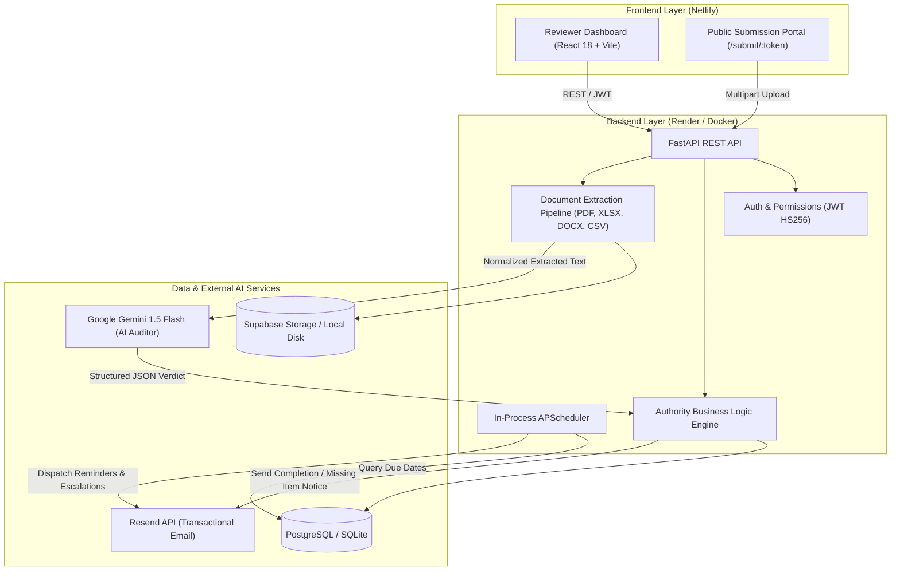
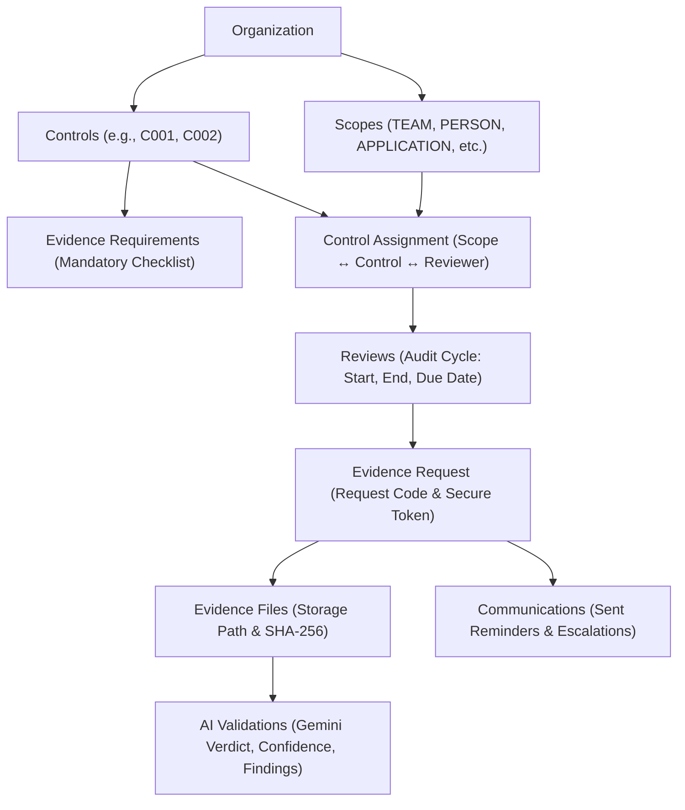
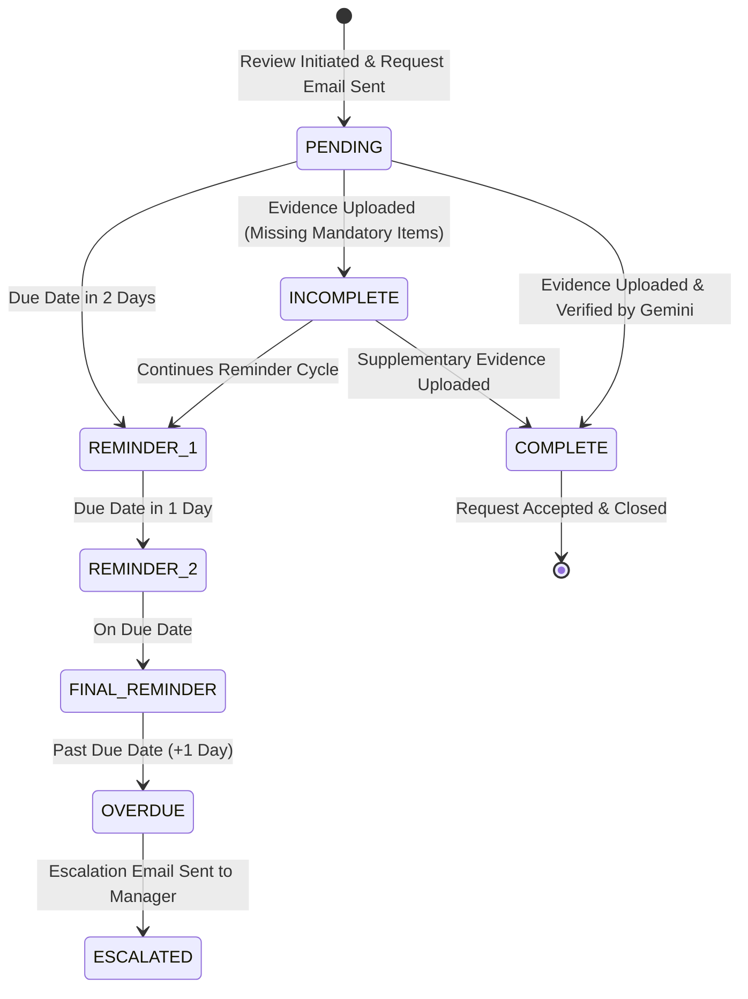

# 🛡️ LOD2 Evidence Bot
### Autonomous Control Testing & AI-Powered Evidence Collection Platform

[](https://ygsupa.netlify.app/)
[](https://ygsupa.netlify.app/)
[](https://render.com)
[](https://fastapi.tiangolo.com)
[](https://react.dev)
[](https://aistudio.google.com)
[](https://www.docker.com/)
[](LICENSE)

---

## 🌐 Live Production Deployment

| Service | Hosting Platform | URL |
| :--- | :--- | :--- |
| **Frontend Web App** | **Netlify** | [👉 https://ygsupa.netlify.app/](https://ygsupa.netlify.app/) |
| **Backend REST API** | **Render** | Dockerized FastAPI Web Service with Health Checks (`/health`) |

> **🚀 Try It Live**: Visit [https://ygsupa.netlify.app/](https://ygsupa.netlify.app/) and use the **1-Click Demo Login** button on the login screen to sign in as **Alice Reviewer** with zero setup!

---

## 📑 Table of Contents
1. [Project Description & Executive Summary](#-project-description--executive-summary)
2. [The Real-World Problem & Our Solution](#-the-real-world-problem--our-solution)
3. [Visual Tour & Platform Screenshots](#-visual-tour--platform-screenshots)
4. [Tech Stack Overview](#-tech-stack-overview)
5. [Core Features Breakdown](#-core-features-breakdown)
6. [System Architecture & Data Flow](#-system-architecture--data-flow)
7. [Document Extraction & Gemini AI Auditor](#-document-extraction--gemini-ai-auditor)
8. [Autonomous Reminder & Escalation State Machine](#-autonomous-reminder--escalation-state-machine)
9. [Project Directory Layout](#-project-directory-layout)
10. [Dockerized Setup & Containerization](#-dockerized-setup--containerization)
11. [How to Run Locally (Step-by-Step Guide)](#-how-to-run-locally-step-by-step-guide)
12. [Default Demo Credentials & Pre-Seeded Data](#-default-demo-credentials--pre-seeded-data)
13. [End-to-End Reviewer Demo Flow](#-end-to-end-reviewer-demo-flow)
14. [Environment Configuration Reference](#-environment-configuration-reference)
15. [REST API Reference](#-rest-api-reference)
16. [Automated Testing Suite](#-automated-testing-suite)
17. [Troubleshooting & FAQ](#-troubleshooting--faq)

---

## 📌 Project Description & Executive Summary

**LOD2 Evidence Bot** is an enterprise-grade compliance automation platform engineered for **Second Line of Defense (LOD2)** control testing, internal audit, and regulatory certification frameworks (such as **SOC 2 Type II, ISO 27001, and SOX ITGC**).

### What is LOD2 (Second Line of Defense)?
In enterprise governance, organizations divide risk management into three lines:
1. **LOD1 (First Line / Operational Teams)**: The engineers, IT admins, and finance managers executing day-to-day operations.
2. **LOD2 (Second Line / Risk, Compliance & Internal Controls)**: Independent reviewers who periodically test whether LOD1 teams are properly adhering to mandatory policies (e.g., *"Did IT review privileged access every 90 days?"*, *"Were production deployments approved by a Change Advisory Board?"*).
3. **LOD3 (Third Line / External Audit)**: Independent external auditors.

### What Does This Platform Do?
The **LOD2 Evidence Bot** automates the entire end-to-end lifecycle of control testing:
1. **Defines Reusable Controls**: Configures control standards with strict evidence requirement checklists.
2. **Dynamic Scoping**: Maps controls to specific organizational targets (Teams, Persons, Applications, Systems) with distinct owner and escalation contacts.
3. **Frictionless Evidence Collection**: Generates period-specific review cycles and dispatches unique, tokenized submission links to control owners. **Submitters do not need to create accounts or learn complex GRC software**.
4. **Multi-Format Ingestion**: Parses uploaded files across **PDF, Excel (XLSX/XLS), Word (DOCX), and CSV**.
5. **Google Gemini 1.5 Flash AI Auditor**: Objectively inspects document contents against mandatory criteria, outputting structured JSON verdicts (`COMPLETE`, `INCOMPLETE`, or `IRRELEVANT`), confidence percentages, factual findings, and missing checklists.
6. **Autonomous Reminders & Escalations**: An in-process background scheduler (`APScheduler`) evaluates approaching deadlines and triggers staged reminders (T-2 days, T-1 day, Due date) and manager escalations idempotently—without requiring external brokers like Redis or Celery.
7. **Tamper-Evident Audit Trail**: Every file is verified with SHA-256 cryptographic hashing, and every system event is recorded in an immutable compliance audit log.

---

## ⚡ The Real-World Problem & Our Solution

| Traditional Manual Audit Pain Points | How LOD2 Evidence Bot Solves It |
| :--- | :--- |
| **Email Chase Fatigue**: Reviewers spend 70% of their time manually writing emails to chase submitters for evidence. | **Autonomous Background Scheduler**: In-process scheduler monitors due dates and sends staged reminders and management escalations automatically. |
| **Submitter Friction**: Control owners are forced to learn heavy, complex enterprise GRC tools just to upload a file. | **1-Click Tokenized Public Portal**: Submitters receive a direct link (`/submit/:token`) allowing drag-and-drop submission in seconds without login. |
| **Slow, Subjective Reviews**: Reviewers take days or weeks manually reading 50-page reports and spreadsheets to verify approvals. | **Instant Gemini 1.5 Flash AI Verification**: Extracts text and tables, checks criteria in seconds, and provides a structured audit assessment and confidence score. |
| **Incomplete Submissions Back-and-Forth**: Submitters upload the wrong file; reviewers notice weeks later, causing missed deadlines. | **Instant Feedback Loop**: Submitter sees exactly what mandatory items are missing on the upload screen and receives an automated missing evidence notification. |
| **Messy Evidence Repositories**: Files stored across personal inboxes, Slack channels, and shared drives. | **Centralized Cryptographic Storage**: SHA-256 hashed files, structured Supabase/local storage, and chronological timelines. |
| **Audit Defense Nightmares**: External auditors request proof of compliance; teams spend days assembling audit logs. | **Filterable Immutable Audit Trail**: Instant export of every control change, upload, reminder, escalation, and AI verdict. |

---

## 🖼️ Visual Tour & Platform Screenshots

### 1. Executive Control Testing Dashboard
The central command center for compliance officers and reviewers, displaying real-time LOD2 metrics (Total Controls, Active Assignments, Active Reviews, Complete, Pending, Incomplete, Overdue), overdue alert banners, and a manual scheduler execution trigger.


---

### 2. Internal Controls Registry
A reusable repository of compliance controls (e.g., `C001 Periodic User Access Review`, `C002 Production Change Management Authorization`, `C003 Vulnerability Fix`). Reviewers can inspect mandatory evidence requirements, frequencies, and active statuses.


---

### 3. Scope & Contact Directory
Dynamic scoping enables controls to be targeted at distinct entity types (`TEAM`, `PERSON`, `APPLICATION`, `DEPARTMENT`). Each scope maintains its own primary contact email and an independent manager escalation contact.


---

### 4. Control Assignments
Binds reusable controls to organizational targets and assigns a designated LOD2 reviewer, establishing testing frequency and effective dates.


---

### 5. Control Review Cycles
Tracks time-bound testing periods (e.g., Q3 2026: 7/10/2026 to 10/8/2026), submission deadlines, and current completion statuses across all assignments.


---

### 6. Public Submission Portal & Gemini AI Card (Recipient Experience)
Business users receive a direct URL (`/submit/:token`). When they upload a file, the **Gemini AI Audit Assessment Card** renders real-time audit findings:
- **Confidence Meter**: Visual bar indicating model confidence percentage (e.g., `94%`).
- **Verified Audit Findings**: Bullet points of factual compliance evidence found in the document.
- **Missing Required Evidence**: Clear list of missing criteria if the status is `INCOMPLETE`.
- **Chronological Timeline**: Full history of notifications, reminders, uploads, and acceptance events.

---

## 💻 Tech Stack Overview

### Frontend
- **Framework**: [React 18](https://react.dev/) (Single Page Application with Vite 5)
- **Styling**: [Tailwind CSS 3.4](https://tailwindcss.com/) with modern slate/blue enterprise dark & light design
- **Routing**: [React Router v6](https://reactrouter.com/) (Protected Routes + Public Tokenized Portals)
- **Icons**: [Lucide React](https://lucide.dev/)
- **HTTP Client**: [Axios](https://axios-http.com/) with JWT authorization interceptors and error handling
- **Hosting**: [Netlify](https://www.netlify.com/) (configured with `_redirects` for SPA history routing)

### Backend
- **Framework**: [FastAPI 0.110+](https://fastapi.tiangolo.com/) (Asynchronous, high-performance Python REST API)
- **Language**: Python 3.11 – 3.13
- **ASGI Server**: [Uvicorn](https://www.uvicorn.org/) with unbuffered logging
- **ORM & Data Layer**: [SQLAlchemy 2.0](https://www.sqlalchemy.org/) & [Alembic](https://alembic.sqlalchemy.org/)
- **Database Support**: Dual-mode:
  - **PostgreSQL / Supabase** (for production deployments)
  - **SQLite** (`sqlite:///./evidence_bot.db`) (zero-configuration local fallback)
- **Background Scheduler**: [APScheduler 3.10+](https://apscheduler.readthedocs.io/) (`BackgroundScheduler` running in-process within FastAPI lifespan)
- **Security & Auth**: JWT (HS256) via `python-jose`, secure password hashing with `bcrypt` / `passlib`
- **Hosting**: [Render](https://render.com/) (Docker Web Service via `render.yaml`)

### Artificial Intelligence & Processing
- **AI Model**: **Google Gemini 1.5 Flash** (`google-generativeai`)
  - Configured with temperature `0.1` and `response_mime_type: "application/json"` for deterministic, repeatable audits.
  - Zero-hallucination prompt instructions requiring strict adherence to provided text.
  - **Offline Fallback**: Built-in deterministic auditor evaluates requirements if API key is not present.
- **Multi-Format Document Parsing**:
  - **PDF**: [PyMuPDF (`fitz`)](https://pymupdf.readthedocs.io/) for page-by-page text layout extraction
  - **Excel**: [openpyxl](https://openpyxl.readthedocs.io/) & [pandas](https://pandas.pydata.org/) for multi-sheet enumeration and table parsing
  - **Word**: [python-docx](https://python-docx.readthedocs.io/) for headings, paragraphs, and embedded tables
  - **CSV**: [pandas](https://pandas.pydata.org/) for tabular normalization

### Storage & Transactional Email
- **File Storage**: [Supabase Storage](https://supabase.com/storage) S3 bucket with local disk storage fallback (`./storage_uploads`)
- **Email Service**: [Resend](https://resend.com/) API for transactional emails, with terminal console mock logging fallback

---

## ✨ Core Features Breakdown

### 1. Reusable Control Catalog
Create and maintain controls with granular checklists:
- Specify testing frequencies (`MONTHLY`, `QUARTERLY`, `SEMI-ANNUAL`, `ANNUAL`).
- Attach multiple mandatory and optional evidence requirements.
- Re-use the same control across dozens of departments and systems.

### 2. Flexible Organizational Scoping
Support real-world corporate hierarchies:
- Target types: `PERSON`, `TEAM`, `DEPARTMENT`, `APPLICATION`, or `SYSTEM_OWNER`.
- Independent recipient email and escalation contact for managers.

### 3. Frictionless Tokenized Submission Portal
- Submitters do not need to register, remember passwords, or navigate complex dashboards.
- Each evidence request generates a cryptographically secure token (`demo-token-itops-2026-0001`).
- Direct drag-and-drop file upload with immediate AI analysis feedback.

### 4. Deep Document Extraction & Semantic Auditing
- Parses structured text up to 35,000 characters.
- Evaluates dates against review period windows (`period_start` to `period_end`).
- Verifies formal manager sign-offs, ticket numbers, and exception reports.

### 5. In-Process Autonomous Background Scheduler
- Powered by `APScheduler` inside FastAPI's async lifespan.
- Runs every 60 minutes (configurable).
- Evaluates due dates and sends Reminder #1 (T-2 days), Reminder #2 (T-1 day), Final Reminder (Due date), and Escalations (+1 day overdue).
- **Idempotency Guarantee**: Checks previous entries in the `communications` database table to prevent duplicate emails.
- Manual trigger button available on the Executive Dashboard for instant testing.

### 6. Cryptographic Integrity & Audit Logs
- Every uploaded document receives a **SHA-256** checksum.
- All actions (control creation, assignments, reviews, requests, uploads, reminders, escalations, AI verdicts) are recorded in the filterable `audit_logs` table.

---

## 📐 System Architecture & Data Flow



### Relational Entity Hierarchy



---

## 🤖 Document Extraction & Gemini AI Auditor

When an evidence document is uploaded:

```
Evidence File (.pdf, .xlsx, .docx, .csv)
       │
       ├── 1. Binary validation & Size check (Max 25 MB)
       ├── 2. Cryptographic Checksum generation (SHA-256)
       ├── 3. Persistence (Supabase Storage bucket OR ./storage_uploads)
       │
       ▼
Document Extraction Pipeline:
       ├── PyMuPDF (fitz)   ──► Layout-aware text extraction per page
       ├── pandas/openpyxl  ──► Sheet enumeration, headers & normalized data rows
       ├── python-docx      ──► Heading, paragraph & embedded table extraction
       └── pandas (CSV)     ──► Formatted tabular serialization
       │
       ▼
Normalized Text Buffer (Extracted context up to 35,000 characters)
       │
       ▼
Google Gemini 1.5 Flash (System prompt enforcing strict LOD2 auditing criteria)
       │
       ▼
Deterministic JSON Verdict:
{
  "status": "COMPLETE" | "INCOMPLETE" | "IRRELEVANT",
  "relevance": "HIGH" | "MEDIUM" | "LOW",
  "confidence": 0.94,
  "missingInformation": ["Exception Report", "Approval Evidence"],
  "findings": ["Active Directory roster present with 42 user accounts"],
  "reason": "The evidence demonstrates active user accounts but lacks required manager approval signoff."
}
       │
       ▼
FastAPI Authority Engine:
  ├── If COMPLETE   ──► Request marked COMPLETE; Completion email dispatched
  └── If INCOMPLETE ──► Request marked INCOMPLETE; Missing items email dispatched
```

> **Strict Architectural Principle: AI Interprets; Backend Decides**  
> The AI never sends emails directly, alters user roles, or modifies permissions. It acts strictly as an objective evidence grader. The deterministic FastAPI backend inspects the AI's structured findings and executes state transitions accordingly.

---

## ⏰ Autonomous Reminder & Escalation State Machine

The platform features an autonomous background scheduler that manages deadline workflows:



---

## 📁 Project Directory Layout

```
YG-Hackathon/
├── README.md                           # Comprehensive documentation (this file)
├── seed.py                             # Root convenience database seeding script
├── create_samples.py                   # Script to generate sample test files (.pdf, .xlsx, .docx, .csv)
├── render.yaml                         # Render Blueprint specification for 1-click cloud deployment
├── sample_evidence/                    # Realistic test evidence files
│   ├── Complete_Access_Review_Q3_2026.pdf
│   ├── Incomplete_User_Roster.xlsx
│   ├── Production_Release_CAB_Signoff.docx
│   └── System_Accounts_Export.csv
├── docs/                               # System guides & specifications
│   ├── ARCHITECTURE.md                 # Detailed architecture design specifications
│   ├── DEMO_FLOW.md                    # 5-10 minute live presentation script
│   ├── PRE_RUN_CHECKLIST.md            # Operator checklist & troubleshooting
│   └── screenshots/                    # Real application screenshots
│       ├── 01_dashboard.png
│       ├── 02_controls_registry.png
│       ├── 03_scopes_directory.png
│       ├── 04_control_assignments.png
│       └── 05_review_cycles.png
│
├── backend/                            # FastAPI Python Backend
│   ├── Dockerfile                      # Production container image definition
│   ├── requirements.txt                # Python dependencies
│   ├── alembic.ini                     # Database migration configuration
│   ├── .env.example                    # Backend environment variables template
│   ├── evidence_bot.db                 # Local SQLite database (auto-generated)
│   ├── storage_uploads/                # Local file storage fallback folder
│   ├── app/
│   │   ├── main.py                     # FastAPI application entrypoint & lifespan
│   │   ├── config.py                   # Pydantic Settings configuration
│   │   ├── api/                        # API route controllers
│   │   │   ├── auth.py                 # JWT login, registration, and user profiles
│   │   │   ├── controls.py             # Reusable controls & evidence requirements
│   │   │   ├── scopes.py               # Organizational scopes & owners
│   │   │   ├── assignments.py          # Control-to-scope reviewer assignments
│   │   │   ├── reviews.py              # Review audit cycles & date windows
│   │   │   ├── requests.py             # Evidence request lifecycle & token endpoints
│   │   │   ├── evidence.py             # File upload, parsing & AI validation trigger
│   │   │   ├── dashboard.py            # LOD2 metrics & manual scheduler trigger
│   │   │   ├── audit.py                # System-wide compliance audit log viewer
│   │   │   └── deps.py                 # Dependency injection (DB session, Auth)
│   │   ├── db/
│   │   │   ├── session.py              # SQLAlchemy engine & session factory
│   │   │   ├── base.py                 # Declarative Base
│   │   │   └── seed.py                 # Seed script with realistic LOD2 demo data
│   │   ├── models/
│   │   │   └── __init__.py             # SQLAlchemy ORM models & Enums
│   │   ├── schemas/
│   │   │   └── __init__.py             # Pydantic request & response schemas
│   │   ├── services/
│   │   │   ├── ai/gemini.py            # Gemini 1.5 Flash client & prompt pipeline
│   │   │   ├── documents/extractor.py  # Multi-format document parsing engine
│   │   │   ├── email/resend_service.py # Resend email client & mock logger
│   │   │   ├── reminders/reminder_engine.py # Evaluation & reminder state machine
│   │   │   └── storage/storage_service.py   # Supabase Storage & local disk handler
│   │   ├── jobs/
│   │   │   └── scheduler.py            # APScheduler background runner
│   │   └── utils/
│   │       ├── security.py             # Bcrypt password hashing & JWT tokens
│   │       └── audit.py                # Immutable audit log recorder
│   └── tests/                          # Automated backend test suite (pytest)
│       ├── conftest.py
│       ├── test_auth.py
│       ├── test_controls_and_scopes.py
│       ├── test_document_extraction.py
│       ├── test_ai_validation.py
│       └── test_reminder_engine.py
│
└── frontend/                           # React 18 + Vite + Tailwind CSS Frontend
    ├── package.json                    # Frontend dependencies & scripts
    ├── vite.config.js                  # Vite configuration
    ├── tailwind.config.js              # Tailwind styling setup
    ├── .env.example                    # Frontend environment variables template
    ├── public/
    │   └── _redirects                  # SPA client-side routing redirect rules
    └── src/
        ├── App.jsx                     # Route definitions & ProtectedRoute wrappers
        ├── main.jsx                    # React entrypoint
        ├── index.css                   # Global Tailwind stylesheets
        ├── context/
        │   └── AuthContext.jsx         # User session, JWT storage & auth state
        ├── layouts/
        │   └── AppLayout.jsx           # App layout with Sidebar and Top Navbar
        ├── components/
        │   ├── Navbar.jsx              # Navigation header with user badge & logout
        │   ├── Sidebar.jsx             # Collapsible application navigation
        │   ├── StatCard.jsx            # Metric summary cards
        │   ├── StatusBadge.jsx         # Color-coded compliance status badges
        │   ├── AIValidationCard.jsx    # Visual Gemini AI score, findings & checklist
        │   └── Timeline.jsx            # Chronological communication & upload feed
        ├── pages/
        │   ├── LoginPage.jsx           # Auth page with 1-Click Demo Login buttons
        │   ├── DashboardPage.jsx       # Executive metrics, overdue alerts & controls
        │   ├── ControlsPage.jsx        # Control catalog & requirements manager
        │   ├── ControlDetailPage.jsx   # Specific control view & requirement edit
        │   ├── ScopesPage.jsx          # Target scopes & owners
        │   ├── AssignmentsPage.jsx     # Active control assignments
        │   ├── ReviewsPage.jsx         # Review cycles list & creation modal
        │   ├── ReviewDetailPage.jsx    # Review status & generated requests
        │   ├── EvidenceRequestsPage.jsx# Evidence requests table & status filters
        │   ├── EvidenceRequestDetailPage.jsx # Full request inspector & review actions
        │   ├── PublicSubmissionPage.jsx# Frictionless upload page for business submitters
        │   └── AuditLogsPage.jsx       # Filterable system audit logs
        └── services/
            └── api.js                  # Axios client with JWT interceptor & API endpoints
```

---

## 🐳 Dockerized Setup & Containerization

The backend is fully containerized using Docker, allowing it to run with zero host dependencies on any machine or cloud provider (e.g., Render, AWS ECS, GCP Cloud Run).

### 1. The Production Dockerfile (`backend/Dockerfile`)
The Dockerfile uses a lightweight multi-stage Python 3.11 base image:
- Installs dependencies without caching.
- Creates storage upload folders.
- Automatically seeds the database on startup.
- Launches Uvicorn bound to the dynamic `$PORT` environment variable.

### 2. Build and Run with Docker Locally

```bash
# 1. Build the Docker image from the backend directory
docker build -t evidence-bot-backend ./backend

# 2. Run the container locally (mapped to host port 8000)
docker run -d \
  --name evidence-bot-backend \
  -p 8000:10000 \
  -e PORT=10000 \
  -e DATABASE_URL=sqlite:///./evidence_bot.db \
  -e JWT_SECRET=super-secret-jwt-key-32-character-min-key-12345 \
  -e CORS_ORIGINS=http://localhost:5173,https://ygsupa.netlify.app \
  -e FRONTEND_URL=https://ygsupa.netlify.app \
  -e GEMINI_API_KEY="" \
  -e RESEND_API_KEY="" \
  evidence-bot-backend
```

- Check the container logs:
  ```bash
  docker logs -f evidence-bot-backend
  ```
- Test health endpoint:
  ```bash
  curl http://localhost:8000/health
  # {"status": "ok", "service": "AI-Powered Evidence Collection Bot", "version": "1.0.0"}
  ```

---

## 🛠️ How to Run Locally (Step-by-Step Guide)

If you prefer to run the application directly from source code without Docker:

### Prerequisites
- **Python**: Version `3.10+` (`python --version`)
- **Node.js**: Version `18.0+` (`node --version`)
- **npm**: Version `9.0+` (`npm --version`)
- **Git**: Installed and available in PATH

---

### Step 1: Clone the Repository
```bash
git clone https://github.com/your-username/YG-Hackathon.git
cd YG-Hackathon
```

---

### Step 2: Setup and Start the Backend (FastAPI)

#### A. Create and activate a Python virtual environment:
**On Windows (PowerShell):**
```powershell
python -m venv venv
.\venv\Scripts\Activate.ps1
```
**On macOS / Linux:**
```bash
python3 -m venv venv
source venv/bin/activate
```

#### B. Install dependencies:
```bash
pip install -r backend/requirements.txt
```

#### C. Configure environment variables:
Copy the template into `backend/.env`:
```powershell
# Windows PowerShell
Copy-Item backend\.env.example backend\.env
```
```bash
# macOS / Linux
cp backend/.env.example backend/.env
```

> **Zero-Config Offline Mode:**
> By default, `backend/.env` is configured to use SQLite (`sqlite:///./evidence_bot.db`), local file storage, terminal mock emails, and rule-based validation fallback. **No cloud accounts are required to run locally!**
> 
> *To enable Google Gemini AI*: Paste your key into `GEMINI_API_KEY=` in `backend/.env` (from [Google AI Studio](https://aistudio.google.com)).
> *To enable Resend Emails*: Paste your key into `RESEND_API_KEY=` in `backend/.env` (from [Resend](https://resend.com)).

#### D. Seed the database:
```bash
python seed.py
```

#### E. Start the FastAPI development server:
```bash
uvicorn app.main:app --reload --app-dir backend --port 8000
```
- API is running at: **`http://localhost:8000`**
- Interactive Swagger API docs: **`http://localhost:8000/docs`**

---

### Step 3: Setup and Start the Frontend (React + Vite)

Open a **second terminal window** in the root directory:

```bash
cd frontend
npm install
```

Configure the environment file:
```powershell
# Windows PowerShell
Copy-Item .env.example .env
```
```bash
# macOS / Linux
cp .env.example .env
```
Ensure `frontend/.env` contains:
```env
VITE_API_BASE_URL=http://localhost:8000
```

Start the Vite dev server:
```bash
npm run dev
```
- The React application is running at: **`http://localhost:5173`**

---

## 🔑 Default Demo Credentials & Pre-Seeded Data

The database comes pre-seeded with ready-to-test accounts and requests:

| Role | Email | Password | Permissions & Actions |
| :--- | :--- | :--- | :--- |
| **Reviewer** | `reviewer@example.com` *(or `Abhishek@gmail.com`)* | `Password123!` | Executive dashboard, review initiation, manual reminders, evidence inspection |
| **Admin** | `admin@example.com` | `Password123!` | Full system management, control creation, scope registration |
| **Business User** | `business@example.com` | `Password123!` | Submitter role for evidence uploads |
| **Escalation Contact** | `escalation@example.com` | `Password123!` | Manager escalation recipient for delinquent requests |

> [!TIP]
> Use the **1-Click Demo Login** buttons on the login screen (`/login`) to sign in instantly as Reviewer, Admin, or Business User.

### Pre-Configured Evidence Requests for Testing

| Request Code | Scope | Control | Due Date Status | Public Upload Portal Link |
| :--- | :--- | :--- | :--- | :--- |
| **`REQ-2026-0001`** | `IT Operations Team` | `C001 Periodic User Access Review` | **Pending** (Due in 5 days) | [Submit REQ-2026-0001](http://localhost:5173/submit/demo-token-itops-2026-0001) |
| **`REQ-2026-0002`** | `Finance Team` | `C001 Periodic User Access Review` | **Overdue** (3 days late) | [Submit REQ-2026-0002](http://localhost:5173/submit/demo-token-finance-2026-0002) |
| **`REQ-2026-0003`** | `Payments Application` | `C002 Production Change Management` | **Complete** (Verified) | [Submit REQ-2026-0003](http://localhost:5173/submit/demo-token-payments-2026-0003) |
| **`REQ-2026-0004`** | `Jai Ram (DBA)` | `C001 Periodic User Access Review` | **Incomplete** (Missing Items) | [Submit REQ-2026-0004](http://localhost:5173/submit/demo-token-john-2026-0004) |

---

## 🎯 End-to-End Reviewer Demo Flow

Follow this 5-minute walkthrough to test the platform using the provided test evidence files:

### Step 1: Sign in as Reviewer
1. Open `http://localhost:5173/login` (or the live URL: `https://ygsupa.netlify.app/login`).
2. Click the **Reviewer** 1-Click button (fills `reviewer@example.com` or `Abhishek@gmail.com`).
3. Click **Sign In**.
4. Review the **Executive Dashboard** metrics showing controls, active assignments, and the red **Overdue Alert Banner**.

### Step 2: Upload Incomplete Evidence (Recipient Portal)
1. Navigate directly to the public submission link for IT Operations:  
   `http://localhost:5173/submit/demo-token-itops-2026-0001`  
   *(Notice that no login is required—simulating the business user experience).*
2. Upload the sample file: `sample_evidence/Incomplete_User_Roster.xlsx`.
3. Click **Upload & Verify**.
4. The Gemini AI auditor extracts the sheet data and flags:
   - Status changes to **`INCOMPLETE`**.
   - Gemini notes the user roster was uploaded, but flags missing **`Approval Evidence`** and **`Exception Report`**.
   - A `MISSING_EVIDENCE` notification is recorded in the timeline.

### Step 3: Upload Complete Evidence
1. On the same submission page, upload: `sample_evidence/Complete_Access_Review_Q3_2026.pdf`.
2. Click **Upload & Verify**.
3. Watch the Gemini AI verification card update in real-time:
   - Status transitions to **`COMPLETE`**.
   - Confidence score reaches **`94%+`**.
   - All 4 mandatory requirements are marked verified.
   - The backend marks the request as `COMPLETE` and triggers a completion email.

### Step 4: Inspect Communication Timeline & Audit Logs
1. Return to `http://localhost:5173/dashboard`.
2. Notice the `Complete` counter has increased.
3. Open `http://localhost:5173/evidence-requests/1` to view the **Communication & Verification Timeline** showing all upload and email events.
4. Open the **Audit Logs** tab in the sidebar to verify the immutable log entries and SHA-256 checksums.

### Step 5: Test Autonomous Reminders & Escalations
1. On the Dashboard, find the red **Overdue Alert Banner** highlighting delinquent submissions from the Finance Team.
2. Click the **Trigger Reminders & Escalations** button.
3. The background scheduler evaluates all open requests, triggers an escalation email to the manager for `REQ-2026-0002`, updates the reminder count, and logs the action idempotently.

---

## ⚙️ Environment Configuration Reference

### Backend Configuration (`backend/.env`)

| Variable | Default Value | Description |
| :--- | :--- | :--- |
| `DATABASE_URL` | `sqlite:///./evidence_bot.db` | PostgreSQL connection string or local SQLite URI |
| `JWT_SECRET` | *(Random 32+ chars)* | Secret key for signing HS256 tokens |
| `JWT_ALGORITHM` | `HS256` | JWT signature algorithm |
| `ACCESS_TOKEN_EXPIRE_MINUTES` | `1440` (24 hours) | Token lifespan before expiration |
| `GEMINI_API_KEY` | `""` | Google AI Studio API key (offline fallback if omitted) |
| `GEMINI_MODEL` | `gemini-1.5-flash` | Gemini model name |
| `RESEND_API_KEY` | `""` | Resend API key (console mock logger fallback if omitted) |
| `EMAIL_FROM` | `onboarding@resend.dev` | Sender address for transactional emails |
| `SUPABASE_URL` | `""` | Supabase project URL (local filesystem fallback if omitted) |
| `SUPABASE_SERVICE_ROLE_KEY` | `""` | Supabase secret key for storage uploads |
| `SUPABASE_STORAGE_BUCKET` | `evidence-files` | Name of storage bucket for evidence files |
| `LOCAL_STORAGE_DIR` | `./storage_uploads` | Directory for local file persistence |
| `FRONTEND_URL` | `http://localhost:5173` | Frontend URL used in generated submission links |
| `CORS_ORIGINS` | `http://localhost:5173,https://ygsupa.netlify.app` | Allowed origins for browser CORS |
| `REMINDER_INTERVAL_MINUTES` | `60` | Background scheduler check frequency |
| `REMINDER_1_DAYS_BEFORE` | `2` | Days before due date to issue Reminder #1 |
| `REMINDER_2_DAYS_BEFORE` | `1` | Days before due date to issue Reminder #2 |
| `ESCALATION_DAYS_AFTER` | `1` | Days overdue before escalating to manager |

### Frontend Configuration (`frontend/.env`)

| Variable | Default Value | Description |
| :--- | :--- | :--- |
| `VITE_API_BASE_URL` | `http://localhost:8000` | Target FastAPI backend URL |

---

## 📡 REST API Reference

The backend provides RESTful endpoints organized by domain:

### Authentication (`/api/auth`)
- `POST /api/auth/register` - Register a new user
- `POST /api/auth/login` - Authenticate credentials and receive JWT
- `GET /api/auth/me` - Retrieve current user profile

### Controls & Scopes (`/api/controls`, `/api/scopes`)
- `GET /api/controls` - List all compliance controls
- `POST /api/controls` - Create a control with evidence requirements
- `GET /api/controls/{id}` - Retrieve control details and checklist items
- `GET /api/scopes` - List organizational scopes (Teams, Applications, Persons)
- `POST /api/scopes` - Register a new scope with owner and escalation email

### Reviews & Requests (`/api/reviews`, `/api/evidence-requests`)
- `GET /api/reviews` - List audit cycles
- `POST /api/reviews` - Initiate a review cycle and generate evidence requests
- `GET /api/evidence-requests` - List all requests with status filters
- `GET /api/evidence-requests/{id}` - Inspect request, uploaded files, and validations
- `GET /api/evidence-requests/token/{token}` - Public portal data lookup for submission token
- `POST /api/evidence-requests/{id}/remind` - Manually trigger a reminder email
- `POST /api/evidence-requests/{id}/escalate` - Manually trigger an escalation email
- `POST /api/evidence-requests/{id}/mark-complete` - Reviewer manual override to accept request

### Evidence Upload & AI (`/api/evidence`)
- `POST /api/evidence/upload` - Multipart file upload (`.pdf`, `.xlsx`, `.docx`, `.csv`); triggers parsing and Gemini AI validation
- `GET /api/evidence/{id}` - Retrieve file metadata and extracted text
- `POST /api/evidence/{id}/revalidate` - Re-run AI validation on an existing file

### Executive Dashboard & Audits (`/api/dashboard`, `/api/audit-logs`)
- `GET /api/dashboard/summary` - Aggregate metrics (total, complete, incomplete, overdue)
- `GET /api/dashboard/overdue` - List delinquent requests
- `POST /api/dashboard/trigger-reminders` - Manually trigger the APScheduler evaluation engine
- `GET /api/audit-logs` - Query filterable system audit events

---

## 🧪 Automated Testing Suite

The backend includes automated unit and integration tests located in `backend/tests/`:
- **`test_auth.py`**: User registration, login, JWT token generation, and role security.
- **`test_controls_and_scopes.py`**: Controls catalog, evidence requirements, and scope assignments.
- **`test_document_extraction.py`**: Layout parsing for PDF, multi-sheet Excel, DOCX, and CSV files.
- **`test_ai_validation.py`**: Gemini AI validation parsing, confidence scores, and rule-based fallbacks.
- **`test_reminder_engine.py`**: APScheduler deadline evaluations and escalation idempotency.

To execute the test suite:
```bash
# Ensure your virtual environment is active
pytest backend/tests/ -v
```

---

## ❓ Troubleshooting & FAQ

### 1. Browser shows "CORS Error" or network request fails
- Ensure the backend server is running on `http://localhost:8000`.
- Verify `backend/.env` contains your frontend origin in `CORS_ORIGINS` (e.g., `http://localhost:5173,https://ygsupa.netlify.app`).

### 2. Can I run the project without a Google Gemini API key?
- **Yes!** The platform includes an offline deterministic rule-based auditor fallback. If `GEMINI_API_KEY` is not provided, the service scans extracted documents against control requirements and returns structured validation results offline.

### 3. Can I run the project without a Resend email key?
- **Yes!** If `RESEND_API_KEY` is omitted, emails are printed directly to the terminal console and saved to the database `communications` table.

### 4. How do I reset the local database?
- Delete `backend/evidence_bot.db` and execute `python seed.py` from the root directory.

### 5. `ModuleNotFoundError: No module named 'fitz'`
- PyMuPDF is installed under the package name `pymupdf`. Run `pip install pymupdf` inside your active virtual environment.

---

## 📄 License

This project is licensed under the MIT License — see the [LICENSE](LICENSE) file for details.
